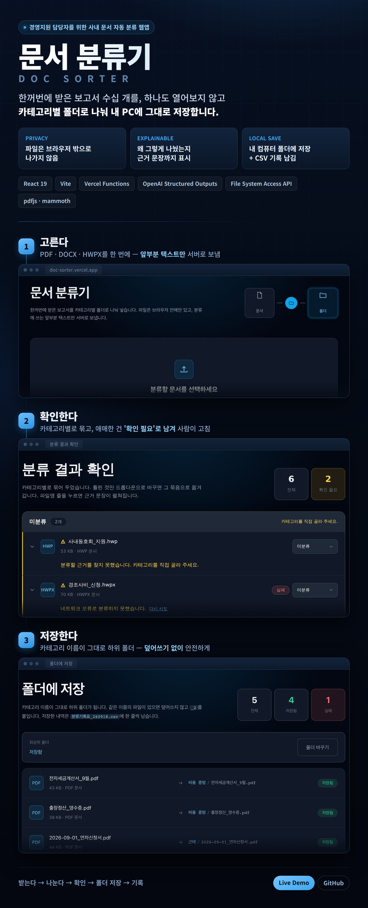
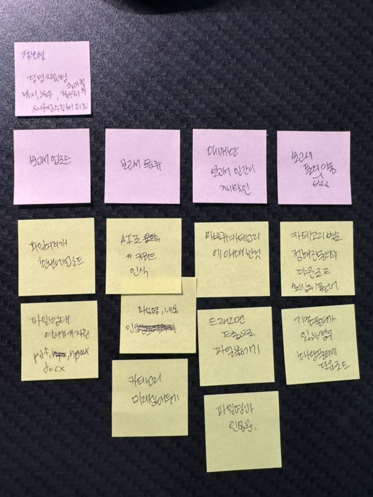

# doc-sorter (문서 분류기)


- 소규모 회사 경영지원 담당자를 위한 문서 자동 분류 웹앱.
- 업로드 된 문서를 지정된 카테고리별로 나눈 뒤에 확인 후 폴더에 저장하고 CSV에 기록합니다.
  
## 기술스택

| 영역 | 기술 |
|---|---|
| **Frontend** | React, Vite, |
| **Backend** | Vercel Functions, Node.js |
| **AI** | OpenAI API, DeepSeek |
| **Storage** | File System API, idb-keyval (IndexedDB) |
| **Testing** | Node --test |
| **Deployment** | Vercel |


## 문제를 어떻게 정의했나요? : 스토리 맵핑



- 공고에서 회의록 분류기 같은 걸 필요로한다는 내용을 봄 그런데 정확히 왜 필요한지 어째서 필요한지 알수가 없었음
- 이전에 비전공자를 위한 회의록 추출기를 개발했음 마크다운 문법으로 복사하기 기능을 구현했음 노션에 붙여넣으라는 의미였음 이때 원문 인용문을 다 집어넣었는데 보통 사용자는 회의가 끝나고 요약 내용을 메일이나 슬랙에 보내려는 목적으로 사용할 가능성이 높다는 걸 생각하지 못함 그래서 나중에 기능을 추가했음 
- 이런 실수를 방지하고자 문서 분류기를 만드는 초반에는 사용자 요구 사항을 명확히 하고 싶었음 그래서 사용자 스토리 맵 만들기 - 제프 패튼 책을 읽고 해당 책에 나온 스토리 맵핑 방법을 사용해서 문제 정의를 명확히함. 처음에는 물리적으로 포스트잇을 사용하고 이걸 바탕으로 에이아이와 함께 고도화함. 
- 그 결과 이전보다 더 명확하게 화면설계서를 만들 수 있었고 릴리스를 3단계로 나눠서 빠르게 완성된 결과물을 볼 수 있었음. 결과물을 보고나서야 생기는 문제점(lib에 함수가 뒤엉키는 상황)을 미리 확인하고  리팩토링까지 해서 효율을 개선했음

## AI를 어떻게 사용했나요?

### ADR를 활용하여 버린 대안을 다시 제안 받지 않도록 했습니다

- 결론 : ADR를 문서화하여 AI가 버린 대안을 다시 제안하는 일이 없도록 하여 생산성을 높였습니다. 
- ADR을 쓰지 않을 때 문제점: AI는 맥락을 까먹어서 이전에 버렸던 제안을 다시 번복하는 경우가 왕왕 발생한다. 이걸 매번 교정할 때마다 시간이 많이 들었음. 
- 문제점을 해결하려는 노력 : 한 대화에서 추론을 끝내고 해당 추론을 이어 붙여서 코드를 구현했음. 그런데 개발 초기에 한 타켓 유저와 같은 것들은 까먹어서 자꾸만 카테고리를 늘리자고 하거나 그럼. 
- 문제점 해결 :이 문제를 방지하기 위해서 ADR 폴더를 생성해서 결정, 이유, 버린 대안을 간단하게 적었습니다. 그 결과 이상한 제안을 하지 않아서 개발 시간이 단축됨

### 대화를 시작할 때 ADR 파일들의 제목만 필수적으로 읽히고 본문은 필요할 때만 읽게 만들었습니다.

- 결론: 대화 시작할 때마다 ADR 문서를 읽으라고 했지만 평소에는 제목만 읽도록 명령했습니다. 해당 아키텍쳐와 관련된 결정을 할 때만 본문을 읽게 만들어서 최대한 토큰을 절약했습니다.
- 이런 선택을 한 이유 1: ADR을 300자 이하로 짧게 적었지만 파일 개수가 늘어날 수록 토큰 요구량이 늘어날 게 뻔했음 
- 이런 선택을 한 이유2: 이미 스토리 맵으로 사용자 흐름을 전체적으로 읽히기에 다른 세부 사항은 몰라도 된다고 판단했음
- 실제로: lib 폴더에 있는 함수를 정리할 때는 해당 결정에 관련된 ADR만 읽어도 진행에 아무런 지장이 없었음

### 특정 AI에 종속되지 않는 개발 환경을 셋팅했습니다.

- 해당 프로젝트는 Claude에서 작업하다가 Codex에서 작업을 해도 맥락을 바로 파악할 수 있도록 만들었습니다. 
- 맥락을 파악할 수 있는 이유1: agents.md에 무조건 대화 시작시 사용자의 어플리케이션 사용 흐름을 기록해둔 STORY_MAP.md을 읽게 만들어서 어플리케이션 흐름을 AI가 이해하게 만들었습니다. 둘 다 매번 읽는 문서라서 본문이 길어지면 토큰 사용량이 늘어납니다. 그렇기에 두 파일의 용량을 최대한 줄이려고 노력했습니다. agents.md는 6줄이고 STORY_MAP은 2000자 이하입니다.
- 맥락을 파악할 수 있는 이유2: 화면 설계 단위에 진행 상황도 코드에 따라서 매번 업데이트 했습니다.
- 맥락을 파악할 수 있는 이유3: 위에 언급한 ADR을 문서화하여 필요하면 에이전트가 파일을 참고할 수 있게 만들었음.
- 결론: 그 결과 성능 좋은 엔진이 나올 때마다 그걸 바로바로 써서 코드에 적용하니까 전체적인 프로덕트 품질이 올라감


## 핵심 설계 결정 ADR

## 시작
```bash
npm install
npm run dev
```

## 스크립트
- `npm run dev` 개발 서버
- `npm run build` 빌드
- `npm test` 테스트 (node --test)