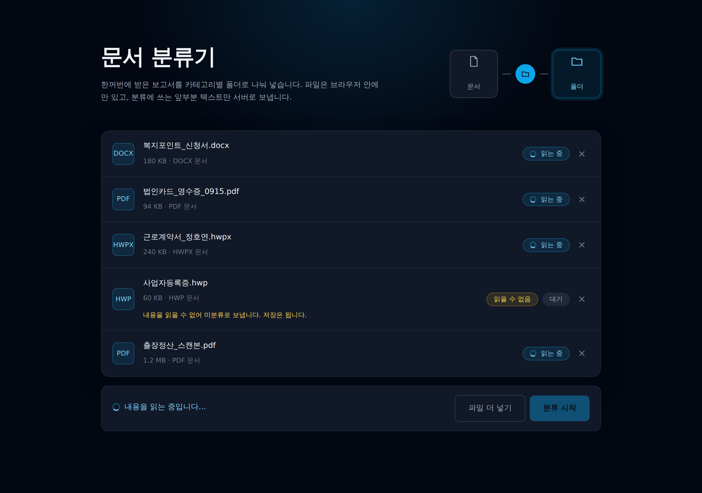
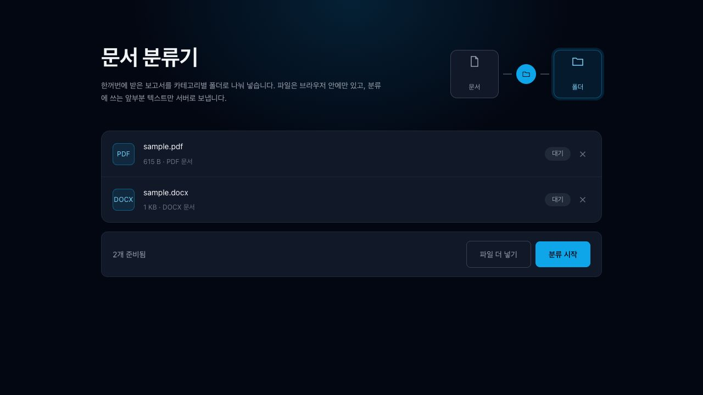
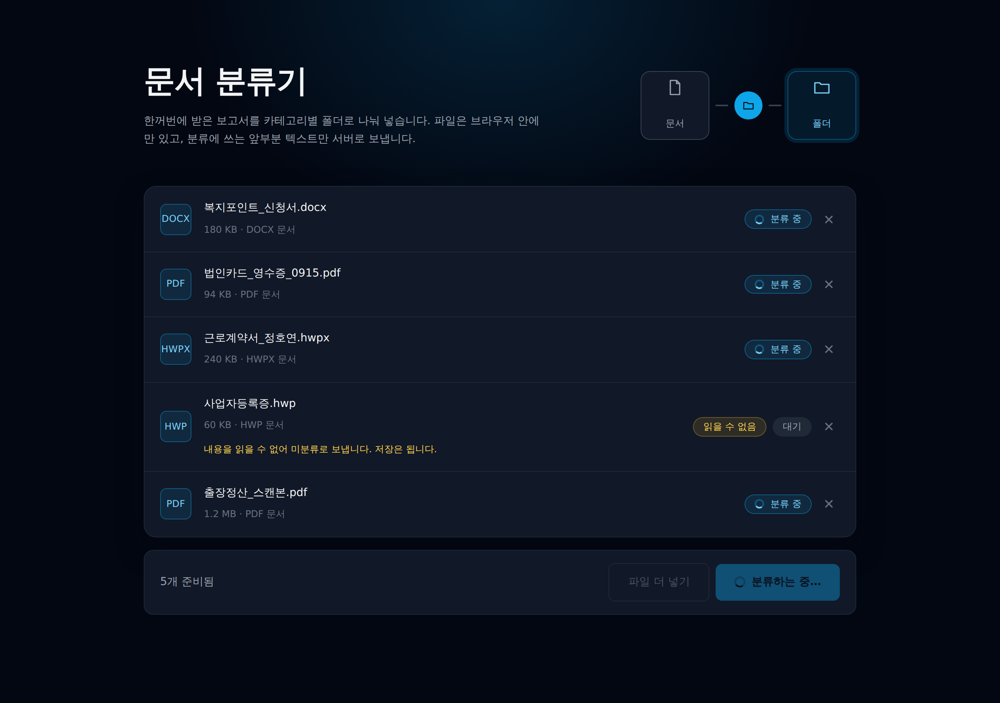
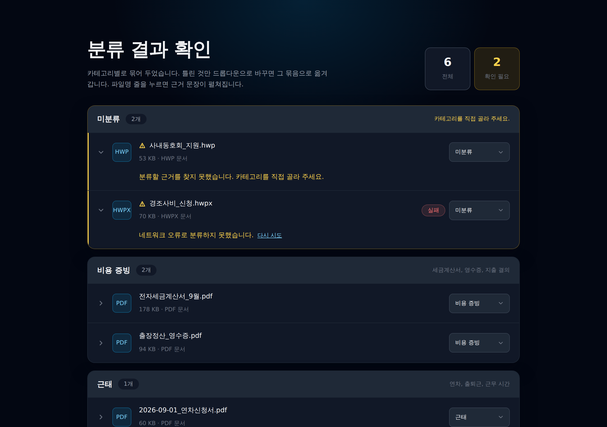
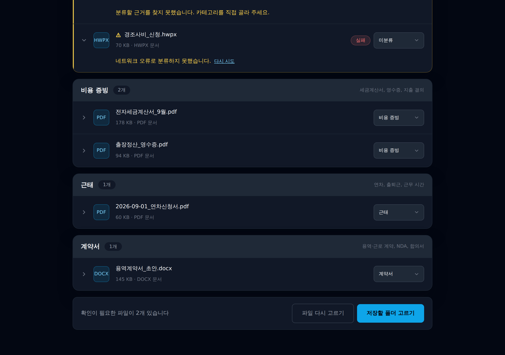
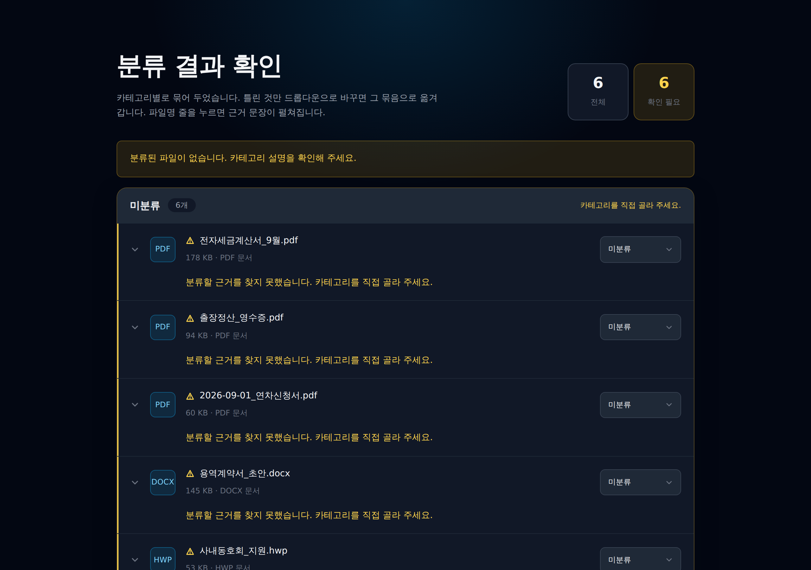
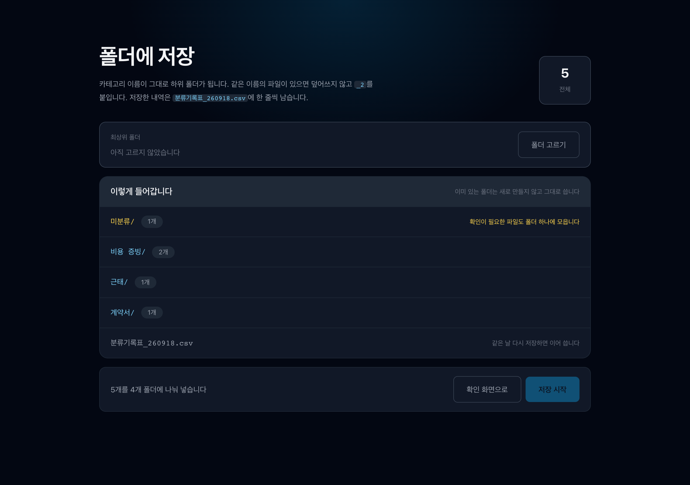
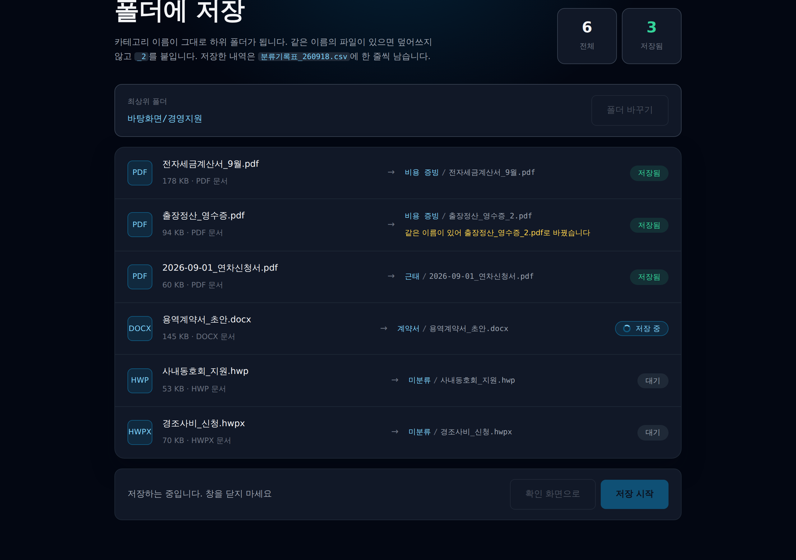
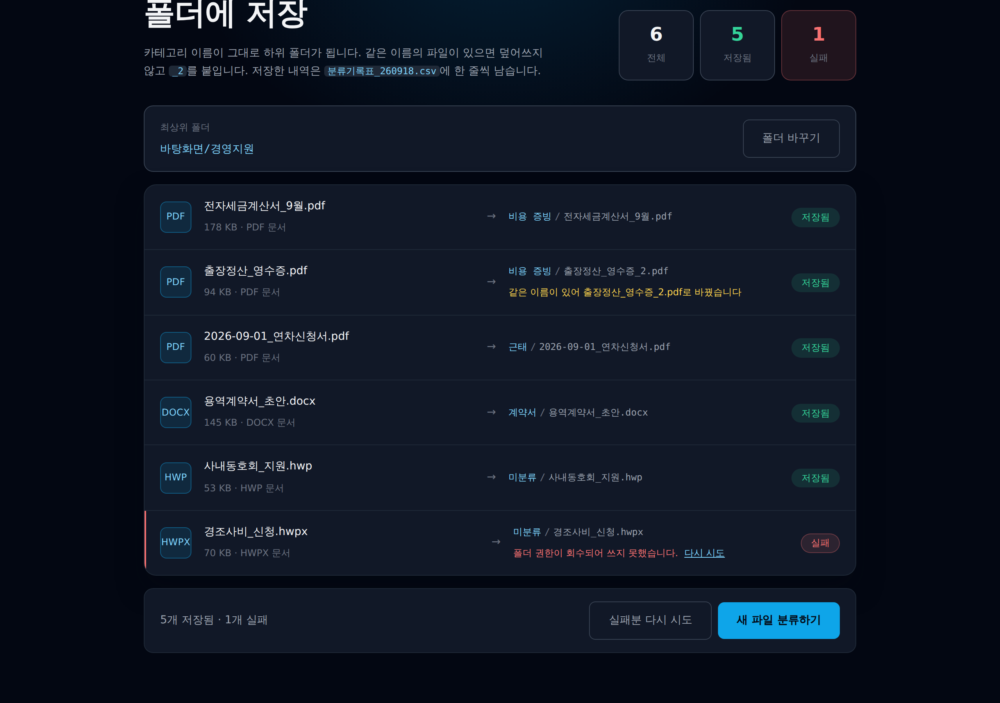

# 화면설계서

화면별 캡처와 예외 상황, 그 처리. 캡처는 R1 구현분을 실제 화면에서 찍은 것이다.
화면을 만드는 작업이면 해당 화면 절을 먼저 읽는다. 화면을 바꿨으면 캡처도 다시 찍어 바꾼다.

캡처 파일은 `docs/screens/`에 둔다. 파일명은 `화면번호-순번-상태` (예: `s1-02-reading.png`).

원칙: **읽지 못하거나 분류하지 못한 파일도 버리지 않는다.** 미분류로 받아 저장·기록은 똑같이 한다. ([ADR 0007](adr/0007-supported-formats.md))

---

## S1 업로드

파일을 받아 텍스트를 꺼내는 화면. 스토리맵 `받는다`.

### 캡처 (2026-09-18, R1)

sky를 강조색, gray를 바탕으로 쓴다. 색 값은 Tailwind 팔레트에서 가져와 CSS 변수로 둔다([0010](adr/0010-design-tokens.md)).
아래 캡처의 파일 목록은 화면을 확인하려고 넣은 예시 파일이다. 실제 업무 문서가 아니다.

| 상태 | 캡처 | 보이는 것 |
|---|---|---|
| 빈 화면 |  | `파일을 선택하면 여기에 목록이 나옵니다.` 파일 선택 버튼만 둔다. 드롭존은 R3 |
| 읽는 중 |  | 파일마다 `읽는 중` 스피너 배지. 다 읽을 때까지 분류 시작 버튼은 비활성 |
| 목록 |  | 다 읽으면 `대기`. `.hwp`는 `읽을 수 없음` 배지와 안내문이 붙지만 목록에서 빠지지 않는다([0007](adr/0007-supported-formats.md)) |
| 분류 중 |  | 읽은 파일만 `분류 중`으로 바뀐다. 읽지 못한 파일도 미분류로 처리되어 확인 화면으로 넘어간다 |

상태 배지는 `대기 · 읽는 중 · 분류 중 · 분류됨 · 저장 중 · 저장됨 · 실패`를 한 컴포넌트로 그린다([0013](adr/0013-partial-classify-failure.md)).
S3 저장 진행 표시도 같은 배지를 쓴다([0011](adr/0011-partial-save-failure.md)).

미지원 브라우저 안내는 `showDirectoryPicker`가 있는 브라우저에서 캡처해서 화면에 나오지 않는다([0012](adr/0012-unsupported-browser.md)).

### 실제 로직 (2026-09-18)

- PDF·DOCX는 브라우저에서 실제 텍스트를 추출한다. HWPX는 R2에서 지원하며 현재는 미분류로 넘긴다.
- 앞부분 최대 6,000자만 보관해 분류 요청에 사용한다. 공백 제외 10자 미만이면 읽을 수 없음으로 처리한다.
- 추출 실패는 해당 파일에 실패 상태를 표시하고, 분류 시작 후 S2에서 재시도할 수 있다.
- 분류는 순차 진행하며 처리 중 파일 추가·삭제를 막는다. 읽기 중 삭제한 파일은 늦은 응답으로 복원되지 않는다.
- 분류가 끝나면 성공·실패·미지원 파일을 모두 S2로 넘긴다.
- 빈 화면·목록 캡처는 실제 로직으로 갱신했다. 읽는 중·분류 중 캡처는 기존 모양 참고용이다.

### 예외

| 발생 시점 | 상황 | 처리 | 사용자에게 보이는 것 | 근거 |
|---|---|---|---|---|
| 파일 선택 직후 | `.hwp`, `.doc`, 이미지 등 텍스트를 못 꺼내는 형식이 섞임 | 목록에서 빼지 않는다. 내용 없이 미분류로 넘긴다 | 행에 `읽을 수 없음` 배지. `내용을 읽을 수 없어 미분류로 보냅니다. 저장은 됩니다.` | [0007](adr/0007-supported-formats.md) |
| 텍스트 추출 직후 | PDF인데 추출 결과가 거의 빔 (스캔·촬영본) | 이미지 PDF로 보고 미분류로 넘긴다 | 위와 같은 배지 | [0007](adr/0007-supported-formats.md) |
| 분류 시작 전 | 선택한 파일이 0개 | 분류 버튼 비활성 | 빈 상태: `파일을 선택하면 여기에 목록이 나옵니다.` | — |

## S2 확인

분류 결과를 사람이 확인하고 고치는 화면. 스토리맵 `나눈다` + `확인한다`. ([ADR 0004](adr/0004-confirm-screen.md))

### 구성 (2026-09-18, 껍데기)

S1과 같은 토큰·카드 모양을 쓴다([0010](adr/0010-design-tokens.md)).

| 자리 | 보이는 것 |
|---|---|
| 머리 | 제목 + 안내문. 오른쪽에 `전체` · `확인 필요` 개수 두 칸. 확인 필요가 1개 이상이면 amber로 바뀐다 |
| 묶음 | 카테고리 하나가 카드 하나. 머리에 카테고리명 · 개수 · 카테고리 설명 한 줄([0002](adr/0002-categories.md)). 파일이 없는 카테고리는 그리지 않는다. 미분류 묶음은 맨 위, 테두리 amber |
| 행 | 왼쪽에 펼침 셰브런 · 파일 아이콘 · 파일명 · 크기/형식, 오른쪽에 카테고리 드롭다운 하나만. 바꾸면 그 묶음으로 바로 옮겨간다([0004](adr/0004-confirm-screen.md)) |
| 펼침 | 미분류·분류 실패인 행만 펼친 채로 시작한다. 나머지는 파일명 왼쪽 셰브런이 있는 줄을 눌러 펼친다. 안에는 근거 인용문 또는 실패 사유 + `다시 시도`, 그리고 `미리보기` |
| 바닥 바 | `파일 다시 고르기` · `저장할 폴더 고르기` |

### 실제 연결 (2026-09-18)

- S1의 파일 목록을 App에서 공유하며, 카테고리 수정은 뒤로 갔다 와도 유지한다.
- `다시 시도`는 실패한 파일 하나만 재처리한다. 읽기 실패는 추출부터, API 실패는 분류부터 다시 한다.
- 재시도 중에는 카테고리 수정과 화면 이동을 막는다.
- `저장할 폴더 고르기`는 실제 목록을 S3으로 전달한다. S3 저장 동작은 여전히 데모다.
- `#s2` 데모 진입 대신 S1의 분류 완료 후 이동한다.
- 근거 인용문은 R2이므로 현재 API 응답은 카테고리만 받는다.

### 캡처 (2026-09-18, 껍데기)

예시 데이터로 찍었다. 실제 업무 문서가 아니다. 1280×900, 2배 배율.

| 상태 | 캡처 | 보이는 것 |
|---|---|---|
| 묶음 |  | 미분류가 맨 위(테두리 amber, 펼친 채). 그 아래 카테고리 묶음. 오른쪽 위 `전체` · `확인 필요` 개수 |
| 근거 펼침 |  | 파일명 줄을 누르면 근거 인용문이 나온다. 인용문 왼쪽에 sky 선 |
| 바닥 바 |  | 아래쪽 묶음들과 `파일 다시 고르기` · `저장할 폴더 고르기` |
| 전부 미분류 |  | `분류된 파일이 없습니다. 카테고리 설명을 확인해 주세요.` 묶음은 하나만 남는다 |

### 예외

| 발생 시점 | 상황 | 처리 | 사용자에게 보이는 것 | 근거 |
|---|---|---|---|---|
| 분류 응답 대기 중 | API 실패·타임아웃 | 해당 파일만 미분류로 두고 나머지 결과는 유지. 재시도 버튼 | 행에 `분류 실패 · 다시 시도` | [0013](adr/0013-partial-classify-failure.md) |
| 응답 검증 시 | 없는 카테고리를 돌려주거나 스키마 위반 (Valibot 실패) | 미분류로 내린다. 근거 인용문은 비운다 | ⚠️ 펼침 상태로 표시 | [0002](adr/0002-categories.md) |
| 결과 렌더 시 | 전부 미분류 | 묶음 하나만 남는다. 카테고리 점검을 권한다 | `분류된 파일이 없습니다. 카테고리 설명을 확인해 주세요.` | [0002](adr/0002-categories.md) · [0004](adr/0004-confirm-screen.md) |

## S3 저장

폴더에 넣고 기록표를 남기는 화면. 스토리맵 `저장한다` + `기록한다`.

### 구성 (2026-09-18, 껍데기)

S1·S2와 같은 토큰·카드 모양을 쓴다([0010](adr/0010-design-tokens.md)). 한 화면 안에서 `고르기 → 저장 중 → 결과` 세 단계로 바뀐다.

| 자리 | 보이는 것 |
|---|---|
| 머리 | 제목 + 안내문(`_2` 규칙과 기록표 파일명). 오른쪽에 `전체` 칸, 저장을 시작하면 `저장됨`, 실패가 생기면 `실패` 칸이 붙는다 |
| 폴더 줄 | 고른 최상위 폴더 경로와 `폴더 고르기` · `폴더 바꾸기`. 저장 중에는 잠근다([0003](adr/0003-web-file-system-access.md)) |
| 미리보기 | 저장 전에만 나온다. 만들어질 카테고리 폴더와 개수, 맨 아래 `분류기록표_YYMMDD.csv` 한 줄([0006](adr/0006-log-csv.md)). 미분류 폴더는 amber |
| 목록 | 저장을 시작하면 미리보기 자리에 들어선다. 한 줄에 `원래 파일명 → 카테고리/저장될 이름` + 상태 배지. 위에서부터 한 줄씩 `저장 중 → 저장됨`으로 바뀐다 |
| 바닥 바 | 저장 전 `확인 화면으로` · `저장 시작`(폴더가 없으면 비활성). 끝나면 결과 문구와 `실패분 다시 시도` · `새 파일 분류하기` |

미분류 파일도 최상위에 두지 않고 `미분류` 폴더에 넣는다([0014](adr/0014-unclassified-folder.md)).
상태 배지는 S1과 같은 컴포넌트다. 여기서는 `대기 · 저장 중 · 저장됨 · 실패`를 쓴다([0011](adr/0011-partial-save-failure.md)).

아직 가짜인 것 (껍데기라서)

- 저장 대상은 S2의 실제 파일 목록을 props로 받는다. 저장 실행은 아직 데모다.
- `폴더 고르기`가 `showDirectoryPicker()`를 부르지 않고 예시 경로만 넣는다. 핸들을 idb-keyval에 기억하는 것도 아직 없다 (`TODO(R1)`, [0003](adr/0003-web-file-system-access.md))
- 저장이 `setTimeout`으로 상태만 바꾼다. 실제 파일 쓰기·`_2` 확인·기록표 이어 쓰기는 없다 (`TODO(R1)`)
- `실패분 다시 시도`는 두 번째에 무조건 성공한다
- S2에서 실제 목록과 함께 넘어온다. `#s3` 데모 진입은 제거했다.

### 캡처 (2026-09-18, 껍데기)

예시 데이터로 찍었다. 실제 업무 문서가 아니다. 1280×900, 2배 배율.

| 상태 | 캡처 | 보이는 것 |
|---|---|---|
| 고르기 전 |  | 폴더가 `아직 고르지 않았습니다`라 `저장 시작`이 비활성. 만들어질 폴더 4개와 개수, 맨 아래 기록표 파일명. 미분류 줄만 amber |
| 저장 중 |  | 위에서부터 한 줄씩 `저장됨`으로 바뀌고 한 줄만 `저장 중` 스피너. `출장정산_영수증.pdf`는 이름이 겹쳐 `_2`가 붙었다는 안내가 amber로 붙는다([0005](adr/0005-filename-conflict.md)) |
| 결과 (실패 포함) |  | `5개 저장됨 · 1개 실패`. 실패한 줄만 왼쪽에 red 선과 사유 · `다시 시도`. 저장된 5개는 그대로 둔다([0011](adr/0011-partial-save-failure.md)) |

### 예외

| 발생 시점 | 상황 | 처리 | 사용자에게 보이는 것 | 근거 |
|---|---|---|---|---|
| 폴더 선택 시 | 사용자가 취소하거나 권한을 거부 | 아무것도 만들지 않고 중단. 확인 화면 상태를 그대로 유지 | `폴더를 선택해야 저장할 수 있습니다.` | [0003](adr/0003-web-file-system-access.md) |
| 파일 쓰기 직전 | 대상 폴더에 같은 이름의 파일이 있음 | `_2`, `_3` … 을 붙인다. 덮어쓰지 않는다 | 행에 `출장정산_영수증.pdf → 비용 증빙/출장정산_영수증_2.pdf`와 amber 안내 한 줄 | [0005](adr/0005-filename-conflict.md) |
| 파일 쓰기 중 | 12개 중 5개를 쓴 뒤 실패 (권한 회수, 용량 부족) | 되돌리지 않는다. 성공분은 두고 실패분만 재시도 | `5개 저장됨 · 7개 실패 · 실패분 다시 시도` | [0011](adr/0011-partial-save-failure.md) |
| 저장 대상에 미분류가 있음 | 읽지 못했거나 분류하지 못한 파일 | 버리지 않고 `미분류` 폴더에 똑같이 저장·기록한다 | 미리보기의 `미분류/` 줄이 amber | [0007](adr/0007-supported-formats.md) · [0014](adr/0014-unclassified-folder.md) |

---

## 아직 결정하지 않은 것

- 없다. 미분류 저장 위치는 2026-09-18에 [0014](adr/0014-unclassified-folder.md)로 정했다.

S1에는 미지원 브라우저 안내와 업로드 차단이 구현되어 있다([0012](adr/0012-unsupported-browser.md)).
